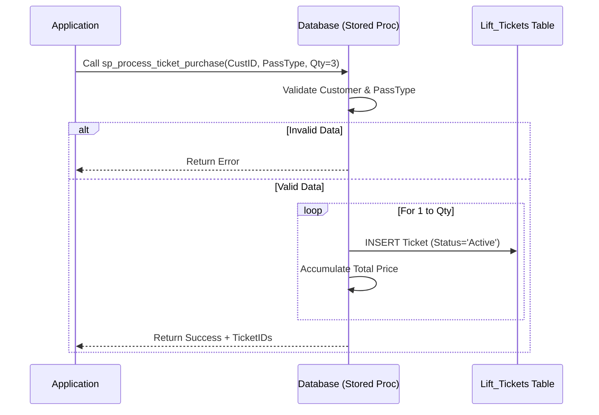
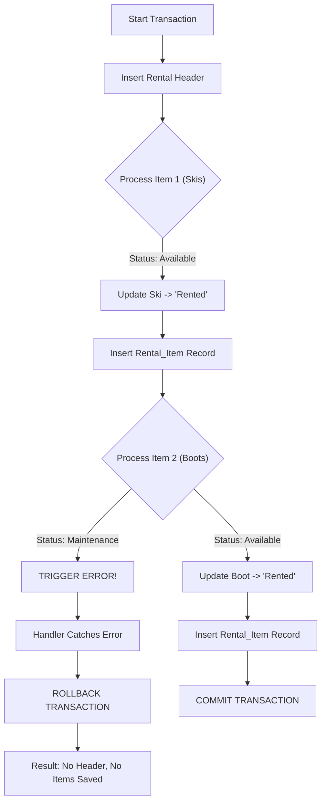

### 5. Conceptual & Logical Design

#### 5.1 Requirements Analysis

**Scope Description**
The "Summit Peaks Management System" is a relational database designed to manage the core revenue streams and operational maintenance of a mid-sized ski resort. The system centralizes data for customer access (ticketing), guest services (rentals and ski school), and infrastructure reliability (maintenance of lifts, trails, and equipment).

**Key Actors**

* **Guests:** Individuals who purchase lift tickets, rent equipment, and enroll in lessons.
* **Instructors:** Employees who manage lesson schedules and class rosters.
* **Maintenance Staff:** Specialized technicians (Lift Mechanics, Trail Groomers) responsible for logging repairs and inspections.
* **Operations Managers:** Staff who oversee lift status (Open/Closed) and analyze revenue.

**Key Business Rules & Constraints**

1. **Safety & Capacity:**
    * Lessons cannot exceed `MaxCapacity` (Safety Ratio).
    * Lifts must track operational status; a lift marked "Closed" cannot be used for trail access calculations.

2. **Temporal Logic:**
    * Rental `ActualReturnDate` can be null (active rental), but if present, it must be on or after the `RentalDate`.
    * Maintenance `CompletedDate` must be ≥ `StartedDate`.

3. **Financial Integrity:**
    * All prices (tickets, lessons, rentals) must be non-negative (`CHECK >= 0`).
    * Historical pricing must be preserved; `Rental_Items` stores the `UnitPrice` at the moment of transaction, ensuring that changing the base price in `Equipment` does not corrupt past financial records.

---

#### 5.2 Entity-Relationship Diagram (ERD)

**Cardinality & Participation Notes:**

* **Customers 1 : N Lift_Tickets** — A customer can buy many tickets; a ticket belongs to exactly one customer.
* **Lifts M : N Trails** — Modeled via `Lift_Access`. A lift can service multiple trails, and a long trail may be accessible from multiple lifts.
* **Rentals M : N Equipment** — Modeled via `Rental_Items`. A single transaction can include multiple physical items (e.g., Skis + Boots + Helmet).

---

#### 5.3 Normalization Proof & Functional Dependencies

We ensured the database structure adheres to **Third Normal Form (3NF)** to eliminate redundancy and update anomalies. Below, we demonstrate this using **Functional Dependency (FD)** notation, where  implies X determines Y.

**1. The Rental System (Transitive Dependency Removal)**

* **Unnormalized Relation:** `Rentals(RentalID, CustomerID, CustomerName, EquipmentID, Brand, RentalDate)`
* **Identified Dependencies:**
  * $RentalID \rightarrow \{CustomerID, RentalDate\}$
  * $CustomerID \rightarrow \{CustomerName\}$ (Transitive Dependency)
  * $EquipmentID \rightarrow \{Brand, Type\}$

* **3NF Resolution:** We decomposed this into three tables to remove the transitive dependency of CustomerName on RentalID.
  * Rentals: $RentalID \rightarrow \{CustomerID, RentalDate\}$
  * Customers: $CustomerID \rightarrow \{CustomerName, Email\}$
  * Equipment: $EquipmentID \rightarrow \{Brand, Type, Status\}$

**2. The Maintenance Logs (Subtype Handling)**

* **Problem:** A single generic `Maintenance_Log` table would create partial dependencies where attributes depend on the *type* of object being maintained rather than the log ID alone.
  * $LogID \rightarrow \{SnowDepth\}$ (Only valid if object is a Trail)
  * $LogID \rightarrow \{PartsUsed\}$ (Only valid if object is Equipment)

* **3NF Resolution:** We normalized this into distinct log tables.
  *  Trail_Maintenance_Logs: $\{LogID\} \rightarrow \{TrailID, SnowDepth, WeatherConditions\}$
  *  Equipment_Maintenance_Logs: $\{LogID\} \rightarrow \{EquipmentID, PartsUsed\}$
  This ensures that every non-key attribute is fully dependent on the primary key, avoiding NULL-heavy storage.
  

---

#### 5.4 Mapping to Relational Schema

This section maps the conceptual relationships to the physical SQL tables found in `01_schema.sql`.

1. **Strong Entities  Tables**
     * Entities like `Customers`, `Instructors`, `Lifts`, and `Pass_Types` map directly to tables with their respective Primary Keys (`CustomerID`, etc.).

3. **One-to-Many (1:N) Relationships  Foreign Keys**
     * **Concept:** A Pass Type defines many Tickets.
     * **Schema:** The `Lift_Tickets` table contains a Foreign Key column `PassTypeID` referencing `Pass_Types(PassTypeID)`.

4. **Many-to-Many (M:N) Relationships  Bridge Tables**
    * **Concept:** Students take Lessons; Lessons have many Students.
    * **Schema:** Created `Enrollments` table.
      * PK: `EnrollmentID`
      * FKs: `CustomerID`, `LessonID`
      * Constraint: `UNIQUE(CustomerID, LessonID)` prevents double-booking.

---

#### 5.5 Transaction & Workflow Design

To ensure data consistency and ACID compliance, we designed specific transaction flows for complex business operations.

**Flow 1: Bulk Ticket Purchase (`sp_process_ticket_purchase`)**
This procedure handles the batch creation of tickets. It demonstrates **Atomicity** (all tickets are created or none are) and **Consistency** (validating pass types before insertion).

**Flow 2: Equipment Rental with ACID Rollback (`08_transactions.sql`)**
This workflow, validated in Test Case 3 & 4 of our transaction script, demonstrates how the system handles **Partial Failures**. If a user tries to rent a mix of valid and broken equipment, the entire transaction rolls back to prevent "orphaned" rental headers.

These flows confirm that our schema supports complex, multi-step business logic while maintaining the integrity of financial and inventory data.
